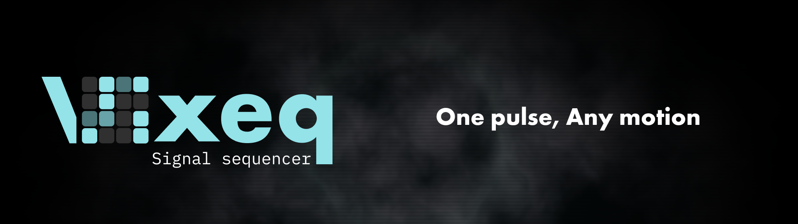

Vixeq is a UI-agnostic step sequencer engine for `0.0` to `1.0` control values.

It is designed to run independently from any UI framework and can be used as the timing core for browser tools, control-signal editors, automation grids, audio experiments, or visual sequencers.

## Install

```sh
npm install @vixeq/core
```

For React integration or the bundled player UI:

```sh
npm install @vixeq/core @vixeq/react
npm install @vixeq/core @vixeq/react @vixeq/player-react
```

## Usage

```ts
import { SequencerEngine, createProject, setStepValue } from "@vixeq/core";

let project = createProject({ bpm: 120, stepCount: 16, trackCount: 4 });
project = setStepValue(project, project.tracks[0].id, 0, 1);

const engine = new SequencerEngine(project);

const off = engine.on("step", (event) => {
  console.log(event.stepIndex, event.tracks);
});

await engine.play();
```

## Packages

- Use `@vixeq/core` when you need a UI-agnostic engine, project helpers, validation, presets, smoothing helpers, or timeline utilities.
- Use `@vixeq/react` when you want React hooks around the core engine without any UI.
- Use `@vixeq/player-react` when you want an editable React sequence player with bundled CSS.

## Examples

This repository includes small examples that are easier to copy than the full playground:

```sh
pnpm --filter vixeq-example-vanilla-core dev
pnpm --filter vixeq-example-react-player dev
pnpm --filter vixeq-example-arrangement-demo dev
pnpm --filter vixeq-example-cycling-workout dev
```

- `examples/vanilla-core`: framework-free usage of `@vixeq/core`.
- `examples/react-player`: controlled `SequencePlayer` usage with external transport controls.
- `examples/arrangement-demo`: multi-pattern, audio-clock-synchronized arrangement playback.
- `examples/cycling-workout`: editable interval cycling targets played as a non-musical arrangement.

The hosted playground demonstrates the full package stack: https://kramhash.github.io/vixeq/

## Package Status

This project is currently in early development. The package surface is intentionally split by responsibility:

- `@vixeq/core`: UI-agnostic sequencer engine, immutable project helpers, validation, timeline utilities, and presets.
- `@vixeq/react`: React hooks for driving the core engine without any GUI.
- `@vixeq/player-react`: An embeddable React sequence player GUI with built-in styles, without a visualizer or audio engine.

The playground app lives in `apps/playground` and demonstrates the package stack with a visualizer, presets, JSON import/export, and local project persistence.

## Current Scope

The current release line is focused on proving the engine and package boundaries:

- deterministic step playback for `0.0` to `1.0` control values
- immutable project helpers and validation
- track transform helpers
- React hooks for using the engine from an app
- an embeddable React sequence player
- a tempo-mapped `TimelineEngine` for sparse cue scheduling (`useTimeline()`)
- multi-pattern arrangements with gaps, seek, looping, tempo changes, and
  section events
- opt-in reduced-motion detection for React animation (`usePrefersReducedMotion`)
- copyable examples
- a hosted playground demo

It does not include an audio engine, MIDI support, DAW-style timeline editing UI, URL sharing, or production stability guarantees.

See [ROADMAP.md](./ROADMAP.md) for planned directions.

The core API is intentionally small:

- `SequencerEngine`
- `createProject`
- immutable project update helpers
- track transform helpers
- `validateProject`
- `normalizeProject`
- built-in presets
